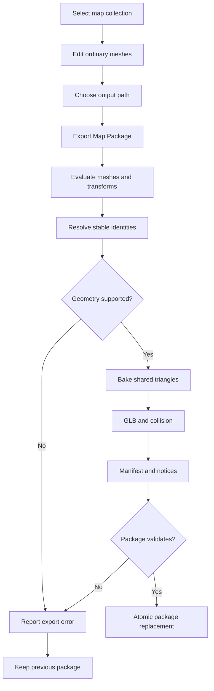

# Export: final edits to package

No scene modifiers are destructively applied. Validation errors block package
replacement; warnings require review.

```mermaid
flowchart TD
  A[Select map collection] --> B[Edit ordinary meshes]
  B --> C[Choose output path]
  C --> D[Export Map Package]
  D --> E[Evaluate meshes and transforms]
  E --> F[Resolve stable identities]
  F --> G{Geometry supported?}
  G -->|No| H[Report export error]
  G -->|Yes| I[Bake shared triangles]
  I --> J[GLB and collision]
  J --> K[Manifest and notices]
  K --> L{Package validates?}
  L -->|No| H
  H --> M[Keep previous package]
  L -->|Yes| N[Atomic package replacement]
```
