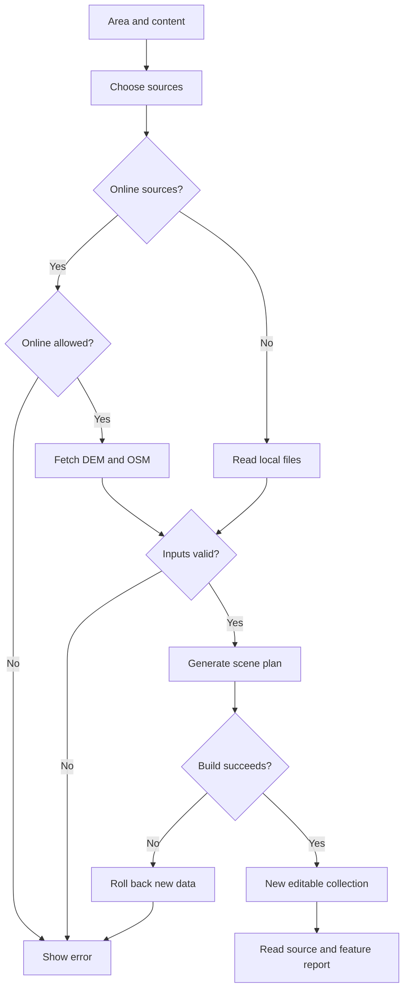

# Generate: source and failure flow

The report is Blender's **MapBuilder Report** text block. Online failures never
silently become synthetic or flat maps.

```mermaid
flowchart TD
  A[Area and content] --> B[Choose sources]
  B --> C{Online sources?}
  C -->|Yes| D{Online allowed?}
  D -->|No| E[Show error]
  D -->|Yes| F[Fetch DEM and OSM]
  C -->|No| G[Read local files]
  F --> H{Inputs valid?}
  G --> H
  H -->|No| E
  H -->|Yes| I[Generate scene plan]
  I --> J{Build succeeds?}
  J -->|No| K[Roll back new data]
  K --> E
  J -->|Yes| L[New editable collection]
  L --> M[Read source and feature report]
```
