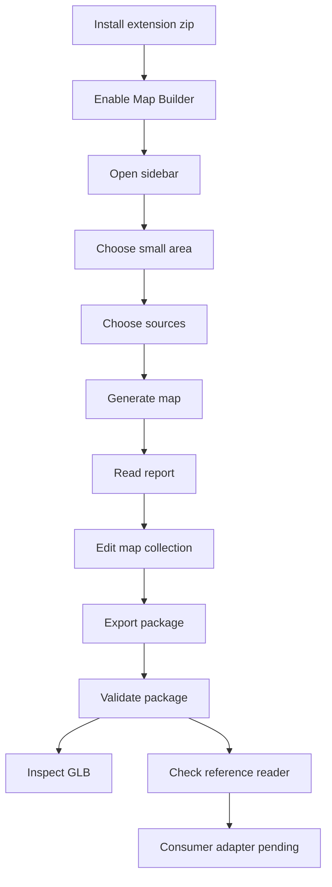

# Map Builder overview

v0.1.0 preview. Detail: [generation](generate.md), [export](export.md),
[consumer handoff](consumer.md).

```mermaid
flowchart TD
  A[Install extension zip] --> B[Enable Map Builder]
  B --> C[Open sidebar]
  C --> D[Choose small area]
  D --> E[Choose sources]
  E --> F[Generate map]
  F --> G[Read report]
  G --> H[Edit map collection]
  H --> I[Export package]
  I --> J[Validate package]
  J --> K[Inspect GLB]
  J --> L[Check reference reader]
  L --> M[Consumer adapter pending]
```
